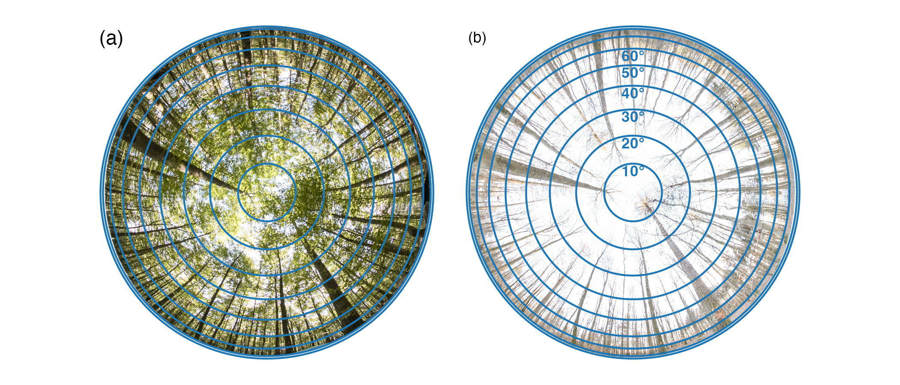

# 📊 LittervsLens: Evaluating LAI from Litter Traps and Hemispherical Photos Across View Zenith Angles and Leaf Fall Phases

## 🌟 Overview
Leaf Area Index (LAI) is a crucial parameter for modeling ecosystem productivity, climate interactions, and hydrological processes. This project compares **Digital Hemispherical Photography (DHP)-derived LAI** with **Litter Trap (LT)-derived LAI** in temperate deciduous forests to evaluate accuracy and spatial footprint alignment. We assess the best-matching **View Zenith Angle (VZA)** and apply the **LXG clumping index** to improve estimation accuracy. Our study finds that **DHP is effective** in estimating LAI for broadleaf forests but faces limitations during leaf fall, leading to overestimation.

## 📂 Repository Structure
```bash
LittervsLens/
│── data/              # Raw and processed data
│   ├── DHP/           # Digital Hemispherical Photography images, structured by LT
│   ├── Figures_data/  # Processed DHP images for figures
│   ├── LT_raw/        # Leaf images from litter traps, structured by date
│   ├── LT_masked/     # Litter trap images with masked leaves
│
│── results/           # Processed data outputs
│   ├── DHP_VZA.csv    # CSV with DHP data for all VZA ranges
│   ├── DHP_Hinge.csv  # CSV with DHP data using the Hinge method
│
│── scripts/           # Code for data analysis and visualization
│   ├── leaf_area.py  # Python script for leaf area calculation
│   ├── HemispheR_process.qmd  # Data manipulation & plotting for DHP data
│   ├── Data_manipulation_plotting.qmd # R script for processing DHP data
│
│── README.md          # Project documentation
```

## 🚀 Installation & Dependencies
### **Prerequisites**
Ensure you have R (≥ 4.0) and Python installed along with necessary packages.

### **Install R Dependencies**
```r
install.packages(c("tidyverse", "ggplot2", "dplyr", "lme4", "hemispheR", "MuMIn", "patchwork", "RColorBrewer", "png", "jpeg", "ggforce", "tidyr", "patchwork", "segmented", "grid", "magick"))
```

### **Install Python Dependencies**
```sh
pip install numpy cv2 os csv scipy
```

## 📊 Usage
Run the scripts in the following order to reproduce the results:
```sh
# Run Python scripts
python scripts/leaf_area.py  # Compute leaf area from LT images

# Run R script
Rscript scripts/HemispheR_process.qmd  # Analyze DHP data using hemispheR
Rscript scripts/Data_manipulation_plotting.qmd # DHP data manipulation and plotting the results
```
Outputs will be saved in the **results/** directory.

## 📈 Results & Figures
Example visualization:



## 🤝 Citation & Contact
If you use this dataset or analysis, please cite:
```
Author(s), Year. Paper Title. Journal. DOI
```
For questions or collaborations:
📧 Email: simon.lotz@posteo.de
